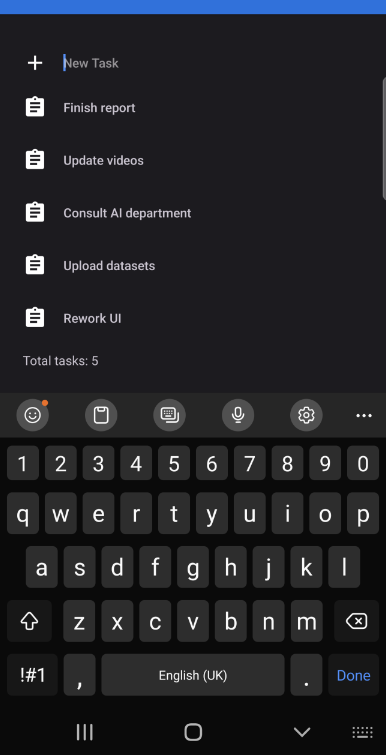

# Практическая работа. Tasks

В данном практическом задании предлагается дописать существующую заготовку Android приложения для составления списка дел.

Советуем сначала склонировать проект и открыть его в Android Studio или IntelliJ IDEA, так как этот процесс может занимать продолжительное время.

В проекте представлена базовая реализация модели данных и описаны запросы к локальной базе данных. Дополните код существующих классов и интерфейсов в местах, которые отмечены **todo**. Отображение списка всех задач на главном экране реализуется при помощи *RecyclerView* и некоторых вспомогательных классов. Внизу экрана выводится количество задач в базе данных&nbsp;–&nbsp;это поле должно обновлять сразу после внесения любых изменений в БД.

В проекте gradle version 7.5, gradle plugin version 4.1.3.

Сдать в систему тестирования необходимо zip архив, в корневом каталоге которого располагается дополненный проект Android Studio/IntelliJ IDEA. После загрузки zip архива приложение будет запущено в системе автоматического тестирования для проверки на соответствие техническому заданию.

Допускается использовать Java и/или Kotlin. При сборке проекта вcе изменения в файле `build.gradle` и файле манифеста будут проигнорированы&nbsp;–&nbsp;будут использованы зависимости только из шаблона-заготовки; не изменяйте пакет приложения.

Тестирование одной посылки может длиться до 3-х минут, после завершения тестирования будет доступна информация об общем числе тестов и числе пройденных тестов. Количество посылок в систему не ограничено. Штраф за повторные попытки не начисляется.

| № | Группа тестов | Проверка |
| - | - | - |
| 1 | insert | поле добавления |
| 2 | init | перезапуск приложения |
| 3 | delete | длительное нажатие |

*Таблица 1. Список тестов*

Рисунок 1. Интерфейс приложения